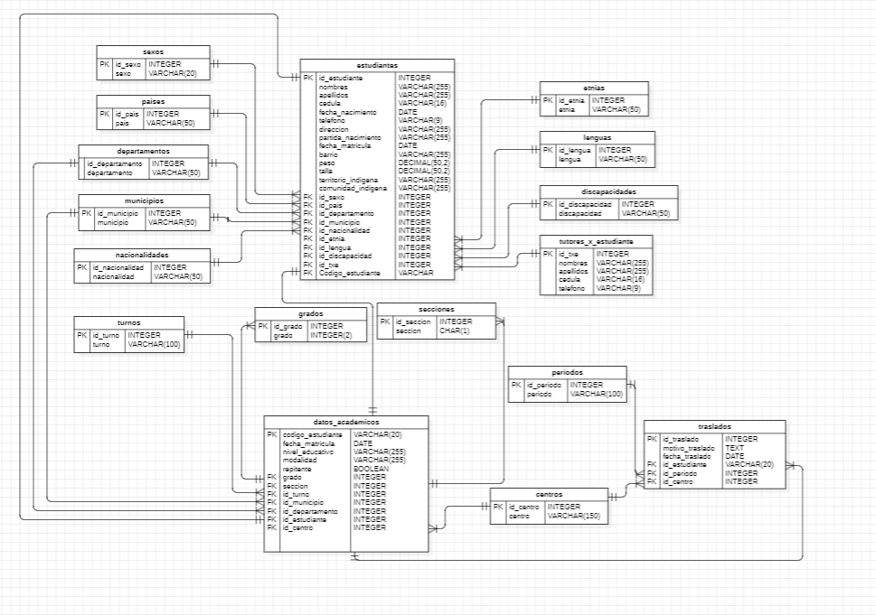

# Base de datos

## Entidades

### sexos
- id_sexo **(PK)**
- sexo

### paises
- id_pais **(PK)**
- pais

### departamentos
- id_departamento **(PK)**
- departamento

### municipios
- id_municipio **(PK)**
- municipio
- id_departamento **(FK)**

### nacionalidades
- id_nacionalidad **(PK)**
- nacionalidad

### etnias
- id_etnia **(PK)**
- etnia

### lenguas
- id_lengua **(PK)**
- lengua

### discapacidades
- id_discapacidad **(PK)**
- discapacidad

### turnos
- id_turno **(PK)**
- turno

### periodos
- id_periodo **(PK)**
- periodo

### centros
- id_centro **(PK)**
- centro

### grados
- id_grado **(PK)**
- grado

### secciones
- id_seccion **(PK)**
- seccion

### tutores_x_estudiantes
- id_txe **(PK)**
- nombres
- apellidos
- cedula
- telefono

### estudiantes
- id_estudiante **(PK)**
- nombres
- apellidos
- cedula
- fecha_nacimiento
- telefono
- direccion
- partida_nacimiento
- fecha_matricula
- barrio
- peso
- talla
- territoria_indigena
- comunidad_indigena
- id_sexo **(FK)**
- id_pais **(FK)**
- id_departamento **(FK)**
- id_municipio **(FK)**
- id_nacionalidad **(FK)**
- id_etnia **(FK)**
- id_lengua **(FK)**
- id_discapacidad **(FK)**
- id_txe **(FK)**
- codigo_estudiante **(FK)**

### datos_academicos
- codigo_estudiante **(PK)**
- fecha_matricula
- nivel_educativo
- modalidad
- repitente
- id_centro **(FK)**
- id_grado **(FK)**
- id_seccion **(FK)**
- id_turno **(FK)**

### traslados
- id_traslado **(PK)**
- motivo_traslado
- fecha_traslado
- codigo_estudiante **(FK)**
- id_periodo **(FK)**
- id_centro **(FK)**

## Módelo de negocios
- Un **_estudiante_** tiene un **_sexo_** **(1:N)**
- Un **_estudiante_** pertenece a un **_pais_** **(1:N)**
- Un **_estudiante_** pertenece a un **_departamento_** **(1:N)**
- Un **_estudiante_** pertenece a un **_municipio_** **(1:N)**
- Un **_estudiante_** tiene una **_nacionalidad_** **(1:N)**
- Un **_estudiante_** tiene una **_etnia_** **(1:N)**
- Un **_estudiante_** tiene una **_lengua_** materna **(1:N)**
- Un **_estudiante_** puede tener una **_discapacidad_** **(1:N)**
- Un **_estudiante_** tiene un **_tutor_** **(1:N)**
- Un **_estudiante_** tiene **_datos-academicos_** **(1:1)**
- Un **_dato-academico_** tiene un **_turno_** **(1:N)**
- Un **_dato-academico_** le pertenece a un **_centro_** **(1:N)**
- Un **_dato-academico_** pertenece a una **_seccion_** **(1:N)**
- Un **_dato-academico_** está en un **_grado_** **(1:N)**
- Un **_traslado_** es hecho por un **_estudiante_** **(1:1)**
- Un **_traslado_** esta hecho en un **_periodo_** **(1:N)**
- Un **_traslado_** viene de un **_centro_** **(1:N)**
- Un **_municipio_** le pertencen a un **_departameno_** **(1:N)**

## Modelo relacional

## Diccionario de datos 
[Diccionario de datos](https://1drv.ms/x/s!AnehkfZvtSTvp25FRPQTkPpqNL5r?e=8wDpue)